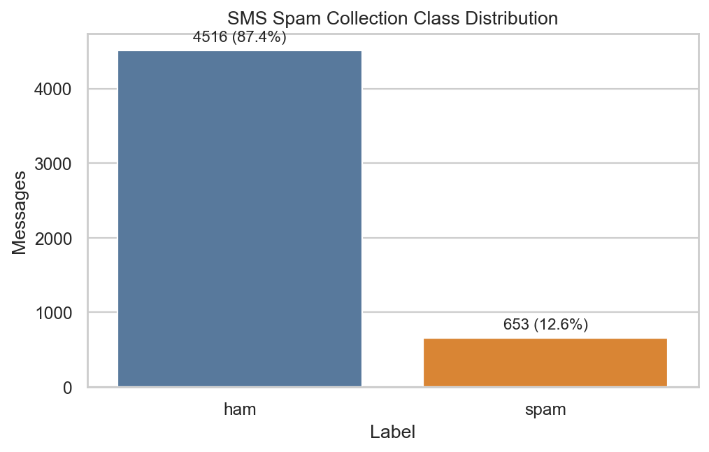
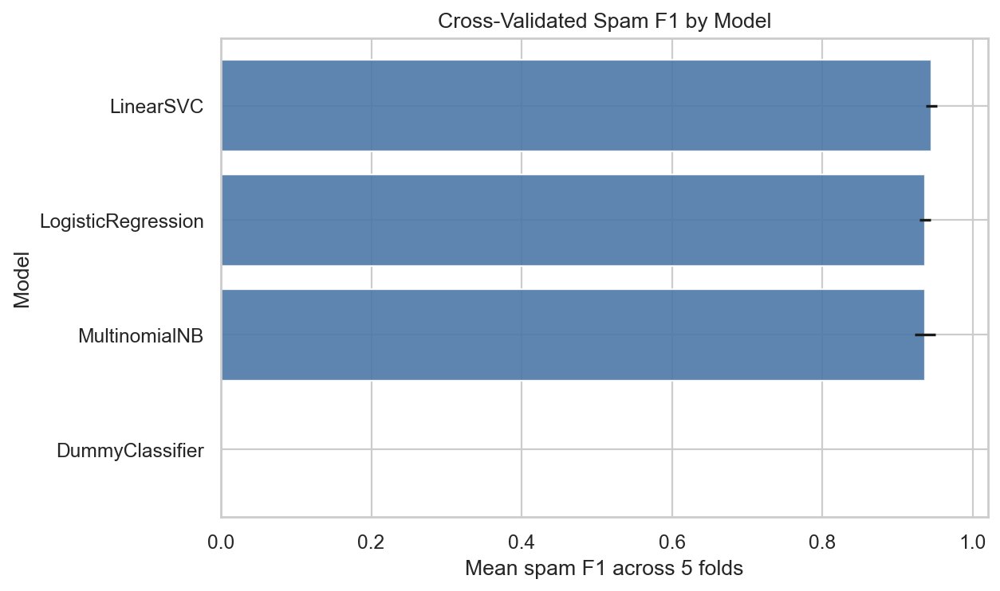
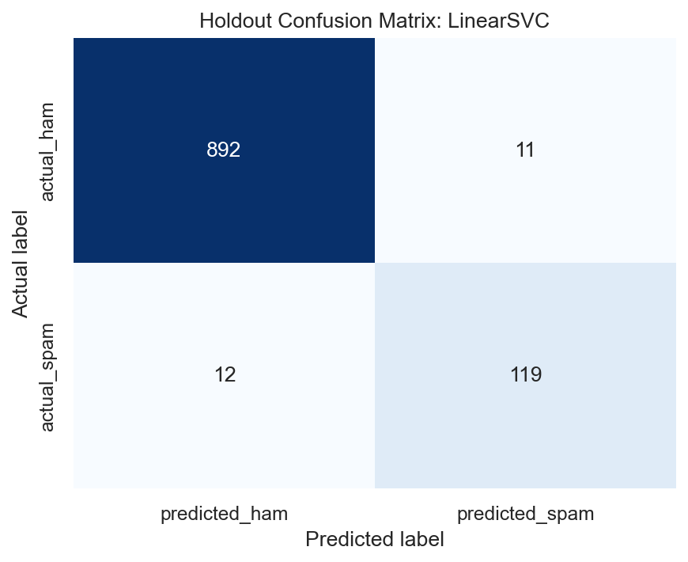

# SMS Spam Classifier

[](https://github.com/mowen18/spam-classifier/actions/workflows/ci.yml)

A classical NLP project for SMS spam classification using the UCI SMS Spam Collection. The workflow emphasizes reproducible data loading, responsible duplicate handling, leakage-safe model selection, sparse TF-IDF features, class-sensitive evaluation, and a final holdout test.

## Project Overview

This project compares a focused set of supervised text classifiers, selects the final model using five-fold cross-validation on the training set, and evaluates the chosen pipeline once on a stratified holdout test split.

## What This Project Demonstrates

- Deterministic loading and validation of the raw SMS dataset
- Exact duplicate removal before train/test splitting
- Conflicting-label detection
- TF-IDF vectorization inside every model-selection pipeline
- Model selection by spam-class F1 rather than accuracy alone
- Final holdout evaluation with precision, recall, F1, average precision, balanced accuracy, accuracy, and confusion matrix
- Lightweight tests for data and modeling helpers

## Dataset

This project uses the UCI SMS Spam Collection:

- Dataset name: SMS Spam Collection
- UCI dataset ID: 228
- DOI: 10.24432/C5CC84
- License: CC BY 4.0
- Creators: Tiago Almeida and José María Gómez Hidalgo

The executed workflow loaded 5,572 raw rows from `data/raw/SMSSpamCollection`, removed 403 exact duplicate `label` / `message` rows, and modeled 5,169 cleaned rows. No message text appeared with conflicting labels.



## Methodology

The notebook uses a single stratified 80/20 train/test split with `random_state=42`. Model selection is performed only on the training set using five-fold `StratifiedKFold` with shuffling. `TfidfVectorizer` is inside each scikit-learn `Pipeline`, so vocabulary and IDF weights are learned within each cross-validation fold.

The test set is used once after selecting the final model and hyperparameters.

## Model Comparison

Models were selected by mean cross-validated spam F1 on the training set.

| Model | Mean CV spam F1 | Std CV spam F1 | Mean spam precision | Mean spam recall | Mean balanced accuracy |
|---|---:|---:|---:|---:|---:|
| LinearSVC | 0.945 | 0.008 | 0.955 | 0.935 | 0.964 |
| LogisticRegression | 0.937 | 0.007 | 0.937 | 0.937 | 0.964 |
| MultinomialNB | 0.936 | 0.014 | 0.989 | 0.889 | 0.944 |
| DummyClassifier | 0.000 | 0.000 | 0.000 | 0.000 | 0.500 |



The comparison is limited to models that work efficiently with sparse text features and are appropriate for supervised text classification.

## Final Results

The selected model was `LinearSVC` with balanced class weights, bigram TF-IDF features, `min_df=1`, sublinear term frequency, and `C=0.5`.

| Selected model | Holdout spam precision | Holdout spam recall | Holdout spam F1 | Balanced accuracy | Accuracy |
|---|---:|---:|---:|---:|---:|
| LinearSVC | 0.915 | 0.908 | 0.912 | 0.948 | 0.978 |

Holdout average precision was 0.973. The final confusion matrix had 892 true ham, 11 false positives, 12 false negatives, and 119 true spam.



## Key Findings

LinearSVC had the strongest cross-validated spam F1 among the focused candidate set. Logistic regression and MultinomialNB were close, which is useful context: the final result is not dependent on a large or fragile model zoo. The holdout errors show that some promotional or short messages remain difficult, so the notebook discusses false positives and false negatives cautiously.

## Repository Structure

```text
README.md
pyproject.toml
data/
  README.md
  raw/
    SMSSpamCollection
images/
  class_distribution.png
  model_comparison.png
  confusion_matrix.png
notebooks/
  01_sms_spam_classification.ipynb
src/
  spam_classifier/
    __init__.py
    data.py
    modeling.py
    evaluation.py
tests/
  test_data.py
  test_modeling.py
```

## Setup

```bash
python -m venv .venv
source .venv/bin/activate
python -m pip install --upgrade pip
python -m pip install -e .
```

If the raw dataset is missing, retrieve it with:

```bash
python -c "from spam_classifier.data import download_sms_spam_collection; download_sms_spam_collection()"
```

## Running The Notebook

Run commands from the repository root:

```bash
source .venv/bin/activate
python -m jupyter nbconvert --to notebook --execute --inplace notebooks/01_sms_spam_classification.ipynb --ExecutePreprocessor.timeout=600
```

## Running Tests

```bash
source .venv/bin/activate
python -m pytest -q
```

## Limitations

- The dataset is historical and relatively small.
- Language, geography, and collection-period biases may affect results.
- Spam vocabulary and delivery patterns evolve over time.
- These results should not be assumed to transfer directly to modern messaging traffic without fresh validation.
- The project is a notebook-centered ML analysis, not a production spam-filtering system.

## Possible Future Improvements

- Evaluate on newer SMS or messaging datasets with documented provenance.
- Add threshold analysis for spam recall versus false-positive tradeoffs.
- Compare calibrated linear models when probability estimates are required.
- Expand error analysis with human-reviewed categories for common false positives and false negatives.

## Dataset Citation

Almeida, T. and Gómez Hidalgo, J. M. (2011). SMS Spam Collection. UCI Machine Learning Repository. DOI: 10.24432/C5CC84. License: CC BY 4.0.
